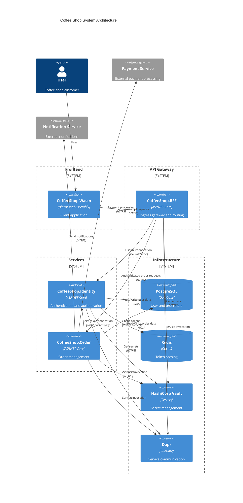

# Coffee Shop Order Management - System Architecture Overview

## System Architecture Diagram

## Key Architectural Changes
- **BFF as Ingress Gateway**: All frontend requests route through CoffeeShop.BFF for authentication and routing only
- **Service-to-Service Authentication**: CoffeeShop.Order uses client_credentials flow with CoffeeShop.Identity
- **Replaced Azure Key Vault with HashiCorp Vault**
- **Enhanced Secret Management with Dapr Secret Store Component**

## Updated Application Responsibilities

### CoffeeShop.BFF (Ingress Gateway)
- Acts as ingress gateway for frontend requests
- Implements request routing to backend services
- Handles user token validation and forwarding
- No data aggregation - pure routing layer
- Provides secure entry point for frontend

### CoffeeShop.SecretStore (New Component)
- Self-hosted secret management using HashiCorp Vault
- Centralized secret storage and retrieval
- Secure initialization and unsealing strategies
- Integrates with Dapr Secret Store Component

### CoffeeShop.Order (Service Authentication)
- Authenticates with CoffeeShop.Identity using client_credentials grant
- Machine-to-machine authentication for BFF requests
- Independent service with dedicated database
- Handles payment and notification integrations

## Technology Stack Updates
- **Secret Management**: HashiCorp Vault (replaced Azure Key Vault)
- **Ingress Pattern**: Implemented with lightweight BFF
- **Service Communication**: Dapr integration with OAuth2 client_credentials
- **Development Orchestration**: .NET Aspire AppHost (development environment only)

## Security Architecture Enhancements
- Centralized secret management via HashiCorp Vault
- User authentication via OAuth2/OIDC through Identity service
- Service-to-service authentication via client_credentials flow
- BFF as ingress point - no direct service exposure
- Request validation at gateway layer

## Communication Patterns
- BFF acts as ingress and routing layer only
- User authentication via OAuth2/OIDC
- Service-to-service authentication via client_credentials
- Dapr for service invocation
- Distributed tracing capabilities

## Infrastructure Scalability
- Lightweight BFF ingress layer
- Flexible secret management via HashiCorp Vault
- Cloud-native architecture with Dapr and kubernetes