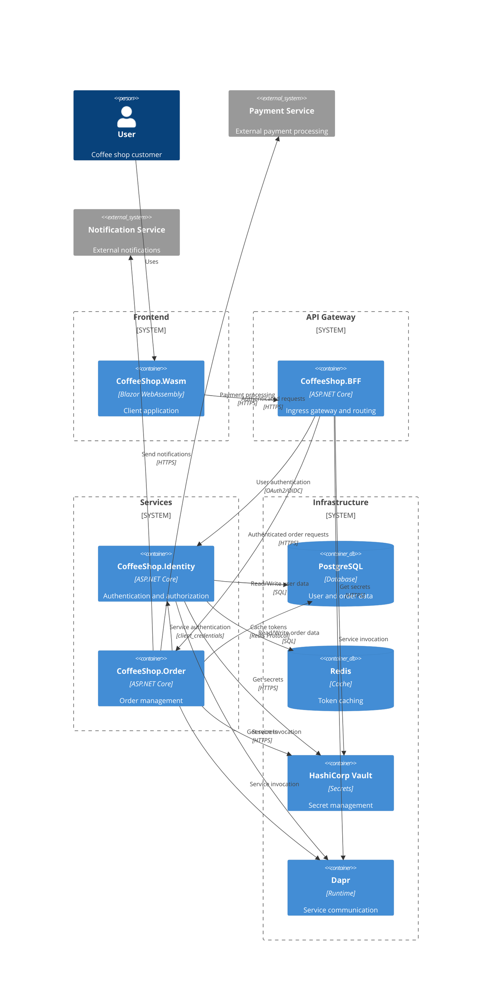

# Coffee Shop Order Management - System Architecture Overview

This is an overview architecture of a coffee sho ordering system designed as microservice pattern.

## System Architecture Diagram

## Application Responsibilities

### CoffeeShop.BFF (Ingress Gateway)
- Acts as ingress gateway for frontend requests
- Implements request routing to backend services
- Handles user token validation and forwarding to client credential authentication
- Handling rate limiting, and circuit breaking
- Aggregate data for front-end purpose 
- Provides secure entry point for frontend
- Provide flexible data access for front-end customized end-points 
- Can cache common responses to improve performance

### CoffeeShop.SecretStore
- Self-hosted secret management using HashiCorp Vault
- Centralized secret storage and retrieval
- Secure initialization and unsealing strategies
- Integrates with Dapr Secret Store Component

### CoffeeShop.Order
- Authenticates with CoffeeShop.Identity using client_credentials grant
- Machine-to-machine authentication for BFF requests
- Independent domain service with dedicated database
- Handles payment and notification integrations

### CoffeeShop.Identity
- Handles all authentication flows, user authentication and client credentials
- Internal persistency of user information side-by-side token management
- Can be used as Dapr internal service 

## Infrastructure Overview 
- User and application authentication through Identity service
- Lightweight BFF ingress layer
- Centralized secret management via HashiCorp Vault
- Cloud-native architecture with Dapr and kubernetes
- Redis as caching database
- PostgresSQL as persistence database
- Kafka as notification system

## Development
- ASPIRE for local cluster development
