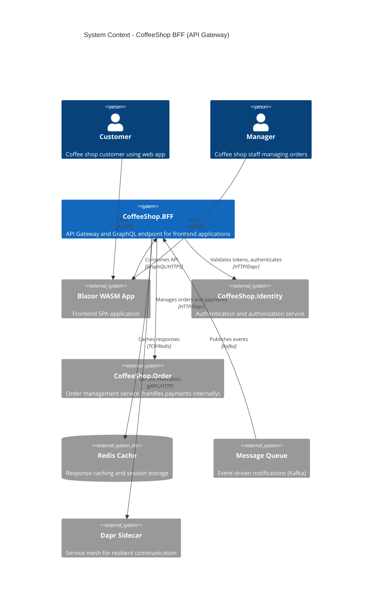
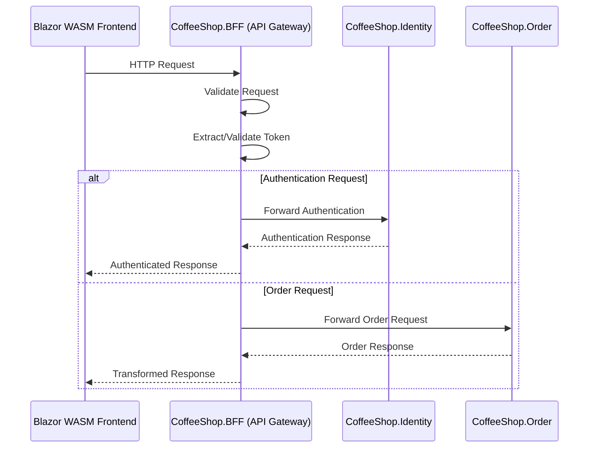

# CoffeeShop BFF (Backend for Frontend) Architecture

The Backend for Frontend (BFF) serves as an API Gateway and intermediary layer between the Blazor WebAssembly (WASM) frontend and backend microservices.

## C4 Model - System Context Diagram



### BFF as an API Gateway Sequence Diagram



## Clean Architecture Layer Structure

```
CoffeeShop.BFF/
├── Domain/
│   ├── DTOs/
│   │   ├── MenuDto.cs
│   │   ├── OrderDto.cs
│   │   └── OrderItemDto.cs
│   ├── ValueObjects/
│   │   └── OrderStatus.cs
│   └── Exceptions/
│       └── ServiceUnavailableException.cs
├── Application/
│   ├── Commands/
│   │   ├── CreateOrderCommand.cs
│   │   └── UpdateOrderStatusCommand.cs
│   ├── Queries/
│   │   ├── GetMenuQuery.cs
│   │   ├── GetOrderByIdQuery.cs
│   │   └── GetAllOrdersQuery.cs
│   ├── Behaviors/
│   │   ├── ValidationBehavior.cs
│   │   ├── LoggingBehavior.cs
│   │   ├── CachingBehavior.cs
│   │   └── CircuitBreakerBehavior.cs
│   ├── DTOs/
│   │   └── GraphQL response models
│   ├── Interfaces/
│   │   ├── IIdentityService.cs
│   │   └── IOrderService.cs
│   └── Mappings/
│       └── MapsterProfile.cs
├── Infrastructure/
│   ├── Services/
│   │   ├── IdentityService.cs
│   │   └── OrderService.cs
│   ├── Caching/
│   │   └── RedisCacheService.cs
│   ├── Events/
│   │   └── OrderStatusChangedEventHandler.cs
│   ├── DaprClient/
│   │   └── DaprServiceInvoker.cs
│   └── Secrets/
│       └── DaprSecretStore.cs
└── API/
    ├── GraphQL/
    │   ├── Queries/
    │   │   ├── MenuQueries.cs
    │   │   └── OrderQueries.cs
    │   ├── Mutations/
    │   │   └── OrderMutations.cs
    │   └── Subscriptions/
    │       └── OrderSubscriptions.cs
    ├── Middleware/
    │   ├── AuthenticationMiddleware.cs
    │   ├── ExceptionHandlerMiddleware.cs
    │   └── RateLimitingMiddleware.cs
    └── Program.cs
```

## Key Responsibilities
1. **Request Routing**
   - Intelligently route requests to appropriate microservices
   - Implement path-based routing strategies
   - Aggregate data through handlers

2. **Token Management**
   - Extract authentication tokens
   - Validate token integrity
   - Forward authenticated requests
   - Handle token refresh mechanisms

3. **Request/Response Transformation**
   - Aggregate responses from multiple services
   - Standardize response formats
   - Add cross-cutting concerns (logging, monitoring)

## Key Design Decisions
- Resilient external service communication
- Aggregate data from multiple sources
- Expose a flexible GraphQL end-point
- Notify front-end applications with GraphQl notification

## Exception Handling
- Use of Exception handler middleware to generate problem details responses
- Return problem details with validation errors from fluent validation exceptions

## Event driven design
- Use of CQRS with mediator pattern
- Use of pipeline behavior in mediator for validation and logging
- Receive notifications from the internal notification system using Dapr
- Notify front-end applications with order change status using GraphQL

## Logging
- Avoid logging throughout the code
- Use the logging pipeline behavior pattern to log commands, responses and exceptions  

## Authentication & Authorization 
- User authentication using the Identity application

## Exposed end-points
- Rest API exposed using the GraphQL 
- Implement rate limiting
- Authenticated end-points

## Mapping
- Classes must be mapped using the Mapster 
- Implement the profile pattern injected in the DI

## Internal service integration
- Use the Dapr client to call internal services (Identity and Order applications only)
- Order service handles payment processing internally
- Circuit breaker for internal service calls
- Retry mechanisms with exponential backoff
- Timeout configurations per service

## Secret Store
- Use of the dapr client secret-store integration
- Retrieve all secrets during application initialization and add to DI, scoped by application

## Validation Rules
- Use of fluent validation defined in the DI
- Use the validation pipeline behavior to validate commands, and responses

## Persistency
- Use of Redis to cache most common requests with ttl
- Use request checksum as cache id  
- Optimized indexes for common queries
- Asynchronous queries for all database operations

## Security Considerations
- HTTPS-only communication
- Token validation middleware
- Rate limiting
- CORS configuration


## Recommended Tools
- .NET 9
- ASP.NET Core
- HotChocolate GraphQL
- MediatR
- FluentValidation
- Mapster
- Dapr
- Docker
- Kubernetes
- Redis
- Kafka