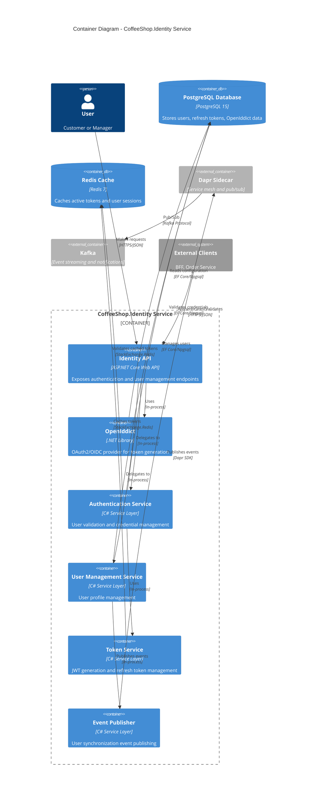
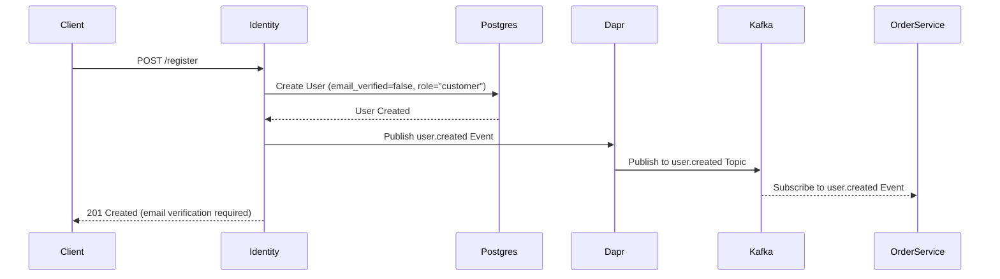
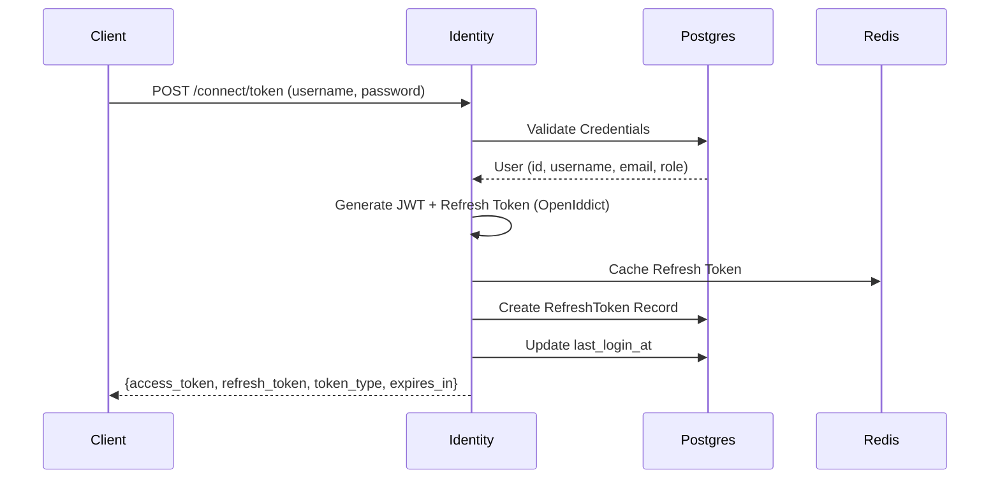
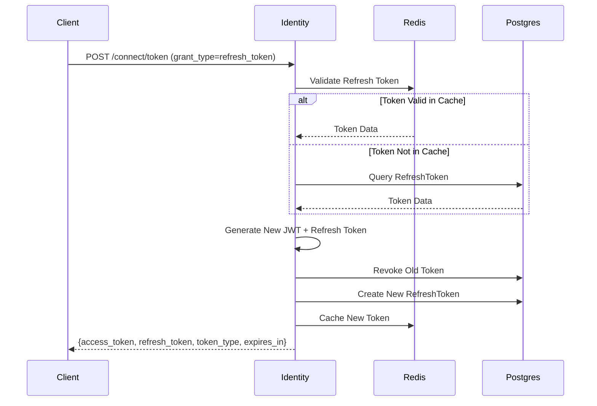
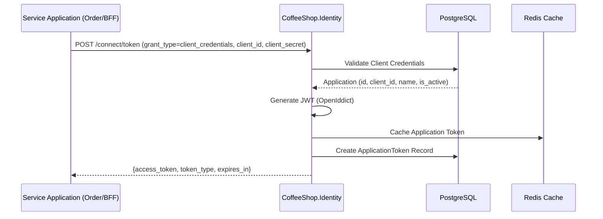

# CoffeeShop.Identity - Authentication and Authorization Architecture

This application is responsible to all users and applications authentication, authorization and identification.

## C4 Model - Container Diagram


## Authentication Flow Integration

### User Registration Flow


### Login Flow with Token Generation (OpenIddict)


### Token Refresh Flow


### Application Authentication Flow (Client Credentials)


---

## Clean Architecture Layer Structure

```
CoffeeShop.Identity/
├── Domain/
│   ├── Entities/
│   │   ├── User.cs
│   │   ├── RefreshToken.cs
│   │   ├── Application.cs
│   │   └── ApplicationToken.cs
│   ├── ValueObjects/
│   │   ├── Email.cs
│   │   └── Password.cs
│   ├── Enums/
│   │   └── UserRole.cs
│   └── Events/
│       ├── UserCreatedEvent.cs
│       └── UserUpdatedEvent.cs
├── Application/
│   ├── Commands/
│   │   ├── RegisterUserCommand.cs
│   │   ├── LoginCommand.cs
│   │   ├── RefreshTokenCommand.cs
│   │   └── AuthenticateApplicationCommand.cs
│   ├── Queries/
│   │   ├── GetUserByIdQuery.cs
│   │   ├── ValidateTokenQuery.cs
│   │   └── ValidateApplicationTokenQuery.cs
│   ├── DTOs/
│   │   ├── UserDto.cs
│   │   └── TokenResponseDto.cs
│   ├── Interfaces/
│   │   ├── IUserRepository.cs
│   │   ├── IApplicationRepository.cs
│   │   └── ITokenService.cs
│   └── Behaviors/
│       ├── ValidationBehavior.cs
│       └── LoggingBehavior.cs
├── Infrastructure/
│   ├── Persistence/
│   │   ├── IdentityDbContext.cs
│   │   ├── UserRepository.cs
│   │   └── Migrations/
│   ├── Identity/
│   │   ├── OpenIddictConfiguration.cs
│   │   └── TokenService.cs
│   ├── Caching/
│   │   └── RedisCacheService.cs
│   ├── Events/
│   │   └── EventPublisher.cs
│   └── ExternalServices/
│       └── MessageQueueService.cs
└── API/
    ├── Controllers/
    │   ├── AuthController.cs
    │   └── UserController.cs
    ├── Middleware/
    │   ├── RateLimitingMiddleware.cs
    │   └── ExceptionHandlerMiddleware.cs
    └── Program.cs
```

### Token Generation Flow
1. **User Login (ROPC Flow)**
   - Client sends username/password
   - Validate credentials against PostgreSQL
   - Generate JWT with user claims (role, username, email)
   - Create refresh token
   - Store tokens in Redis
   - Return tokens to client

2. **Token Refresh**
   - Client sends refresh token
   - Validate refresh token
   - Generate new access token
   - Rotate refresh token
   - Return new tokens

3. **Service-to-Service (Client Credentials)**
   - Service sends client_id/client_secret
   - Generate access token with service claims
   - Return short-lived token (5 minutes)

## Key Design Decisions

## Exception Handling
- Use of Exception handler middleware to generate problem details responses
- Return problem details with validation errors from fluent validation exceptions

## Event driven design
- Use of CQRS with mediator pattern
- Use of pipeline behavior in mediator for validation and logging
- Publish notifications to the internal notification system using Dapr
- Publish user events only to internal notification system

## Logging
- Avoid logging throughout the code
- Use the logging pipeline behavior pattern to log commands, responses and exceptions  

## Authentication & Authorization 
- OAuth2 and OpenID Connect compliant
- Use the OpenIddict to handle all authentication and authorization service 
- Supports authentication flows:
  - Resource Owner Password Credentials (ROPC) for SPA login
  - Client Credentials for service-to-service
- Token lifetimes:
  - Access token: 15 minutes
  - Refresh token: 30 days
- Simple role-based claims (Customer, Manager)

## Exposed end-points
- Rest API exposed using the OpenIddict 
- Exposed end-points using the Dapr

## Mapping
- Classes must be mapped using the Mapster 
- Implement the profile pattern injected in the DI

## Internal service integration
- Order service handles payment processing internally
- Circuit breaker for internal service calls
- Retry mechanisms with exponential backoff
- Timeout configurations per service

## Secret Store
- Use of the dapr client secret-store integration
- Retrieve all secrets during application initialization and add to DI, scoped by application

## Validation Rules
- Use of fluent validation defined in the DI
- Use the validation pipeline behavior to validate commands, and responses

## Persistency
- Use of Redis to cache
- Redis for active refresh tokens (TTL-based)
- User profile cache (5-minute TTL)
- Token storage with sliding expiration
- Use of PostgreSQL to persist all domain models
- Use Entity Framework for database operations
- Use the ServiceDefaults persistence extension to automatic apply migrations 
- Use Entity Framework to insert the product data during the migrations
- Optimized indexes for common queries
- Asynchronous queries for all database operations

## Security Best Practices

### Password Policy
- Minimum length: 8 characters
- Require: Uppercase, lowercase, digit, special character
- Complexity validation on client and server
- BCrypt cost factor: 12

### Rate Limiting
- Login attempts: 5 per 15 minutes per IP
- Registration: 3 per hour per IP
- Token refresh: 10 per minute per user
- Refresh Token rotation

### Encryption
- Passwords: BCrypt with cost factor 12
- Refresh tokens: SHA-256 hashing
- In transit: TLS 1.3 for all communications

## Recommended Tools
- .NET 9
- ASP.NET Core
- MediatR
- FluentValidation
- Entity Framework Core
- Npgsql
- Mapster
- Dapr
- Docker
- Kubernetes
- Redis
- Kafka
- OpenIddict

### OpenIddict Setup Example
```csharp
services.AddOpenIddict()
    .AddCore(options => {
        options.UseEntityFrameworkCore()
            .UseDbContext<IdentityDbContext>();
    })
    .AddServer(options => {
        options.SetTokenEndpointUris("/connect/token")
               .SetUserinfoEndpointUris("/connect/userinfo");

        options.AllowPasswordFlow()
               .AllowRefreshTokenFlow()
               .AllowClientCredentialsFlow();

        options.RegisterScopes("openid", "profile", "email", "roles");

        options.AddEphemeralEncryptionKey()
               .AddEphemeralSigningKey();
    })
    .AddValidation(options => {
        options.UseLocalServer();
        options.UseAspNetCore();
    });
```