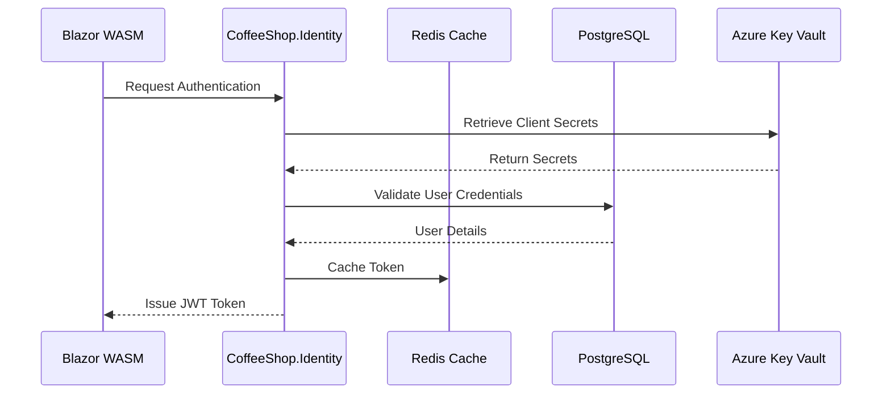

# CoffeeShop.Identity - Authentication and Authorization Architecture

## Authentication Flow Sequence Diagram



## Architecture Components

### Duende IdentityServer Configuration
- OAuth2 and OpenID Connect compliant
- Supports multiple client types:
  - Frontend SPA (implicit flow)
  - Backend services (client credentials)
- Configurable token lifetimes
- Custom claims and scope management

### PostgreSQL Identity Schema
```sql
CREATE TABLE Users (
    Id UUID PRIMARY KEY,
    Username VARCHAR(100) NOT NULL,
    Email VARCHAR(255) NOT NULL,
    PasswordHash VARCHAR(255) NOT NULL,
    Role VARCHAR(50) NOT NULL,
    CreatedAt TIMESTAMP DEFAULT NOW()
);

CREATE TABLE UserClaims (
    Id UUID PRIMARY KEY,
    UserId UUID REFERENCES Users(Id),
    ClaimType VARCHAR(100),
    ClaimValue VARCHAR(500)
);
```

### Redis Caching Strategy
- Token storage with sliding expiration
- Operational data caching
- Distributed session management
- Configuration:
  ```csharp
  services.AddStackExchangeRedisCache(options => {
      options.Configuration = "redis-connection-string";
      options.InstanceName = "identity-service";
  });
  ```

### Token Generation Flows
1. **User Login Flow**
   - Validate credentials against PostgreSQL
   - Generate JWT with user claims
   - Store token in Redis
   - Return token to client

2. **Service-to-Service Authentication**
   - Client credentials flow
   - Machine-to-machine token generation
   - Short-lived access tokens

### User Metadata Persistence
- Extensible user profile model
- Support for additional user attributes
- Claims-based authorization
- GDPR and privacy considerations

### Security Considerations
- Argon2 password hashing
- Multi-factor authentication support
- Brute-force protection
- Token revocation mechanisms
- Audit logging for authentication events

### Configuration Example
```csharp
services.AddIdentityServer()
    .AddConfigurationStore()
    .AddOperationalStore()
    .AddAspNetIdentity<ApplicationUser>()
    .AddProfileService<CustomProfileService>();
```

## Key Design Decisions
- Centralized authentication service
- Separation of concerns
- Scalable and flexible identity management
- Cloud-native authentication architecture