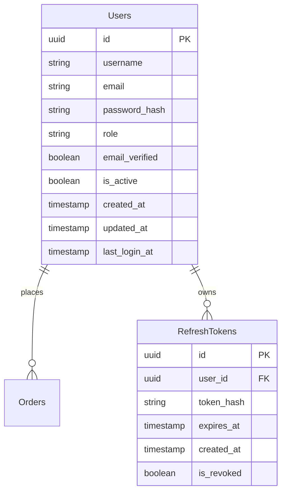

# CoffeeShop.Identity Data Models

## Entity Relationship Diagram

## Entity Descriptions

### Users Entity
Represents authenticated users in the identity system with essential profile and security information.

**Key Attributes:**
- `id` (UUID, PK): Unique identifier for the user
- `username` (string, unique, required): User's display name for identification (3-50 chars)
- `email` (string, unique, required): User's email address for communication and authentication
- `password_hash` (string, required): BCrypt hashed password for secure authentication
- `role` (string, required): Access level - "customer" or "manager"
- `email_verified` (boolean, default: false): Email verification status
- `is_active` (boolean, default: true): Account activation status
- `created_at` (timestamp, required): Account creation timestamp
- `updated_at` (timestamp, required): Last profile update timestamp
- `last_login_at` (timestamp, nullable): Last successful login timestamp

**Business Rules:**
- Email must be unique and validated against standard email format
- Username must be unique and contain only alphanumeric characters and underscores
- Password hash must be generated using BCrypt (cost factor: 12)
- Email verification required before full account access
- Inactive accounts cannot authenticate
- Two roles only: "customer" (places orders) and "manager" (manages orders and products)

**Security Considerations:**
- Password hashing: BCrypt with cost factor 12
- Rate limiting on login endpoint (5 attempts per 15 minutes)
- Token-based authentication using OpenIddict
- Session management via Redis

**Relationships:**
- One user can place many orders (1:N with Orders in Order service)
- One user can have many refresh tokens (1:N with RefreshTokens)

**Synchronization with Order Service:**
- User data is synchronized to Order service via message queue
- Order service maintains denormalized user snapshot (username, email, role)
- Changes to username, email, or role trigger sync events

---

### RefreshTokens Entity
Long-lived tokens for session management and token refresh flow.

**Key Attributes:**
- `id` (UUID, PK): Unique refresh token identifier
- `user_id` (UUID, FK, required): Reference to the token owner
- `token_hash` (string, required): SHA-256 hashed refresh token
- `expires_at` (timestamp, required): Token expiration timestamp
- `created_at` (timestamp, required): Token creation timestamp
- `is_revoked` (boolean, default: false): Revocation status

**Business Rules:**
- Refresh tokens are long-lived (default: 30 days)
- Access tokens are short-lived (default: 15 minutes)
- Token rotation: New refresh token issued on each refresh
- Old refresh token is marked as revoked automatically
- Tokens stored as SHA-256 hash for security
- Expired tokens are purged via background job (retention: 90 days)

**Security Considerations:**
- Token rotation prevents replay attacks
- Revocation supports immediate logout
- Maximum concurrent sessions per user (default: 5)

**Relationships:**
- Belongs to one user (N:1 with Users)

**Redis Caching:**
- Active refresh tokens cached in Redis for fast validation
- Cache key: `refresh_token:{token_hash}`
- TTL matches token expiration
- Cache invalidated on revocation
