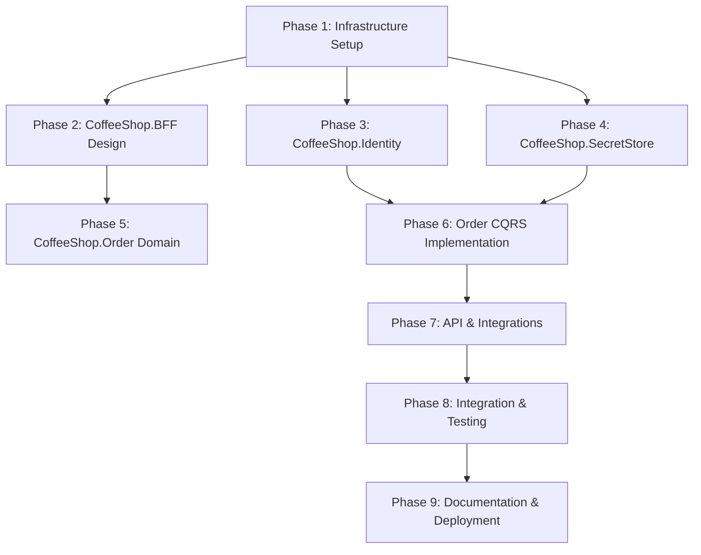

# Coffee Shop Order Management Implementation Plan

## Project Overview
A comprehensive implementation plan for building a robust, scalable Coffee Shop Order Management system using modern .NET technologies and cloud-native architecture.

## Implementation Phases and Diagram

## 1. Phase Breakdown and Detailed Tasks

### Phase 1: Infrastructure & Foundation Setup
**Duration**: 3-5 days
**Parallel Tasks**: ✅
**Dependencies**: None

#### Infrastructure Tasks
- [ ] 1.1 PostgreSQL AppHost Configuration
  - Set up connection strings
  - Configure connection pooling
- [ ] 1.2 Redis Configuration
  - Set up connection
  - Configure caching strategies
- [ ] 1.3 Dapr Component Configuration
  - Install Dapr sidecars
  - Configure service invocation components
- [ ] 1.4 HashiCorp Vault Preparation
  - Design secret hierarchy
  - Prepare initialization scripts
  - Create Dockerfile for Vault container

### Phase 2: CoffeeShop.BFF Design
**Duration**: 4-5 days
**Parallel Tasks**: ✅
**Dependencies**: Phase 1 Infrastructure

#### BFF Implementation Tasks
- [ ] 2.1 Request Routing Configuration
  - Design routing strategy
  - Implement YARP reverse proxy
  - Configure service-specific routes
- [ ] 2.2 Token Management
  - Implement token validation middleware
  - Design token forwarding mechanism
- [ ] 2.3 Response Transformation
  - Create response aggregation logic
  - Implement cross-cutting concerns
- [ ] 2.4 Security Configuration
  - Implement rate limiting
  - Configure CORS
  - Add request validation

### Phase 3: CoffeeShop.Identity Implementation
**Duration**: 5-7 days
**Parallel Tasks**: ✅
**Dependencies**: Phase 2 BFF

#### Identity Service Tasks
- [ ] 3.1 Duende IdentityServer Configuration
  - Update client configurations for BFF
  - Modify token generation flows
- [ ] 3.2 Token Handling
  - Implement enhanced token management
  - Configure token validation for BFF
- [ ] 3.3 Database Integration Updates
  - Adjust PostgreSQL identity schema
  - Update EF Core migrations

### Phase 4: CoffeeShop.SecretStore
**Duration**: 3-4 days
**Parallel Tasks**: ✅
**Dependencies**: Phase 1 Infrastructure

#### Secret Management Tasks
- [ ] 4.1 HashiCorp Vault Setup
  - Create Dockerfile
  - Implement initialization scripts
  - Design secret hierarchy
- [ ] 4.2 Dapr Secret Store Integration
  - Configure Vault as Dapr secret store
  - Implement secret retrieval methods
- [ ] 4.3 Secret Rotation Strategy
  - Design key rotation mechanism
  - Implement secure unsealing process

### Phase 5: CoffeeShop.Order Domain Layer
**Duration**: 4-6 days
**Parallel Tasks**: ✅
**Dependencies**: Phase 3 Identity

#### Domain Modeling Tasks
- [ ] 5.1 Update Domain Entities
  - Modify Order aggregate for BFF compatibility
  - Adjust value objects
- [ ] 5.2 Service Layer Updates
  - Refactor order creation service
  - Enhance business rule validation

### Phase 6: CoffeeShop.Order CQRS Implementation
**Duration**: 5-7 days
**Parallel Tasks**: ✅
**Dependencies**: Phase 5 Domain Layer

#### CQRS Tasks
- [ ] 6.1 Command Handlers Update
  - Modify CreateOrder command for BFF
  - Enhance command validation
- [ ] 6.2 Query Handlers Refinement
  - Update order lookup queries
  - Optimize filtering mechanisms

### Phase 7: API & Integrations
**Duration**: 4-6 days
**Parallel Tasks**: ✅
**Dependencies**: Phase 3, 4, 6

#### API Development Tasks
- [ ] 7.1 Controller Modifications
  - Update RESTful endpoints for BFF
  - Implement comprehensive documentation
- [ ] 7.2 External Integrations
  - Reconfigure payment processing
  - Update notification service integrations

### Phase 8: Integration & Testing
**Duration**: 5-7 days
**Parallel Tasks**: ✅
**Dependencies**: Previous Phases

#### Integration Tasks
- [ ] 8.1 Frontend Integration
  - Update Wasm authentication flows
  - Validate BFF service integration
- [ ] 8.2 Comprehensive Testing
  - Develop BFF-specific tests
  - Update integration test suites
- [ ] 8.3 Performance Testing
  - Benchmark BFF request routing
  - Validate secret management performance

### Phase 9: Documentation & Deployment
**Duration**: 3-4 days
**Parallel Tasks**: ✅
**Dependencies**: All Previous Phases

#### Deployment Preparation
- [ ] 9.1 Documentation Updates
  - Update architectural diagrams
  - Document BFF and secret management
- [ ] 9.2 CI/CD Configuration
  - Update GitHub Actions
  - Configure Vault deployment pipeline

## Project Statistics
- **Total Phases**: 9
- **Estimated Total Implementation Time**: 36-48 days
- **Critical Path Components**:
  1. BFF Design
  2. Secret Management
  3. Identity Service Reconfiguration
- **Parallel Execution Opportunities**: 6

## Technology Stack Updates
- .NET 8
- Duende IdentityServer
- HashiCorp Vault
- Dapr
- YARP Reverse Proxy

## Recommended Team Structure
- 1 Infrastructure Specialist
- 2 Backend Developers
- 1 Frontend Developer
- 1 DevOps Engineer
- 1 QA Specialist

## Risk Mitigation Strategies
- Incremental BFF implementation
- Comprehensive secret management testing
- Gradual migration from Azure Key Vault
- Continuous performance monitoring