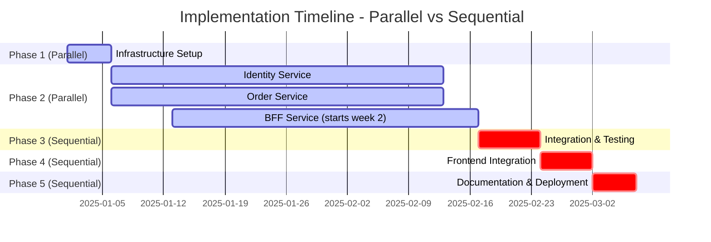

# Coffee Shop Order Management - Master Implementation Plan

## Overview

Comprehensive implementation plan for scalable Coffee Shop Order Management system using microservices architecture.

**Duration**: 44-61 days (parallel) | **Tech**: .NET 9, OpenIddict, Kafka, Dapr, PostgreSQL 15, Redis 7, GraphQL

---

## Implementation Phase Hierarchy

**Legend**: Green (Active) = Parallel execution | Red (Critical) = Sequential execution | **Total**: 44-61 days

---

## Phase 1: Infrastructure Setup (3-5 days)

**Parallel**: ✅ | **Team**: DevOps + Infrastructure Specialist

- [x] Setup PostgreSQL 15 with AppHost configuration
- [x] Setup Redis 7 for caching in AppHost
- [x] Setup Kafka cluster for event streaming in AppHost
- [x] Configure Dapr sidecars and components
- [x] Setup HashiCorp Vault for secret management in AppHost
- [x] Configure .NET Aspire for local development
- [ ] Prepare CI/CD pipeline structure
- [x] Create all application docker files to generate images

---

## Phase 2: Service Development (29-38 days)

**Parallel**: ✅ | **Team**: 3 Backend Developers (parallel tracks)

### 2A: Identity Service (29-38 days)
**Reference**: `docs/identity/identity-implementation-plan.md`

- [ ] Domain Layer (2-3 days)
- [ ] Database & Redis (3-5 days)
- [ ] OpenIddict Configuration (3-4 days)
- [ ] User Authentication ROPC Flow (3-4 days)
- [ ] Client Credentials Flow (2-3 days)
- [ ] Kafka Event Publishing (2-3 days)
- [ ] API Endpoints (2-3 days)
- [ ] Testing & Deployment (6-8 days)

**Outputs**: OAuth2/OIDC endpoints, user registration/auth, service-to-service auth, user lifecycle events

---

### 2B: Order Service (29-38 days)
**Reference**: `docs/order/order-implementation-plan.md`

- [ ] Domain Layer (3-4 days)
- [ ] Database Setup (2-3 days)
- [ ] Application Commands & Queries (5-7 days)
- [ ] External Services Integration (3-4 days)
- [ ] Kafka Event Publishing (2-3 days)
- [ ] API Endpoints (3-4 days)
- [ ] Authentication & Authorization (2-3 days)
- [ ] Testing & Deployment (6-8 days)

**Outputs**: 5 REST endpoints, payment integration, notification service, order events, user event subscription

---

### 2C: BFF Service (27-35 days, start 1 week after services)
**Reference**: `docs/bff/bff-implementation-plan.md`

- [ ] Domain Layer (2 days)
- [ ] Service Interfaces (2 days)
- [ ] Dapr Service Invocation (3-4 days)
- [ ] Redis Caching (2-3 days)
- [ ] GraphQL Schema (3-4 days)
- [ ] Event Subscriptions (2-3 days)
- [ ] Authentication (2-3 days)
- [ ] Testing & Deployment (6-8 days)

**Outputs**: GraphQL endpoint, Dapr service invocation, Redis caching, real-time subscriptions, rate limiting

---

## Phase 3: Integration & Testing (5-7 days)

**Parallel**: ❌ | **Team**: All Developers + QA | **Dependencies**: Phase 2

- [ ] End-to-end integration testing (registration → login → order → delivery)
- [ ] Test all GraphQL operations and event-driven flows
- [ ] Cross-service integration (BFF ↔ Identity, BFF ↔ Order, Order ↔ Identity)
- [ ] Event flow validation (user events, order events)
- [ ] Performance testing (load tests, GraphQL benchmarks, circuit breaker behavior)
- [ ] Validate Redis cache effectiveness

---

## Phase 4: Frontend Integration (4-6 days)

**Parallel**: ❌ | **Team**: Frontend + Backend Developer 3 | **Dependencies**: Phase 3

- [ ] Blazor WASM authentication flow (login/registration via GraphQL, token management)
- [ ] Menu and order management UI (GraphQL queries, order creation/tracking)
- [ ] Real-time notifications (GraphQL subscriptions for order status changes)
- [ ] Error handling and UX polish

---

## Phase 5: Documentation & Deployment (3-5 days)

**Parallel**: ❌ | **Team**: All team members | **Dependencies**: Phase 4

- [ ] Update architecture documentation
- [ ] API documentation (GraphQL schema, REST endpoints)
- [ ] Deployment guides (Kubernetes, Aspire)
- [ ] Operations runbooks (monitoring, troubleshooting)
- [ ] Generate Kubernetes manifests with Aspire8
- [ ] Setup production CI/CD pipelines
- [ ] Production deployment validation

---

## Technology Stack

**Core**: .NET 9, ASP.NET Core, Blazor WebAssembly, HotChocolate GraphQL, OpenIddict OAuth2/OIDC

**Data**: PostgreSQL 15, Redis 7, Entity Framework Core, Npgsql

**Messaging**: Kafka, Dapr (service mesh & pub/sub)

**Patterns**: MediatR (CQRS), FluentValidation, Mapster, Polly (resilience), BCrypt.Net

**DevOps**: .NET Aspire, Aspire8, Docker, Kubernetes, HashiCorp Vault

---

## Timeline Summary

**Parallel Execution**: ~44-61 days

**Sequential Execution**: ~93-123 days

**Time Saved**: ~49-62 days (50-53% reduction)

---

## Team Structure

### Recommended (Parallel)
- 1 Infrastructure/DevOps Engineer
- 3 Backend Developers (Identity, Order, BFF)
- 1 Frontend Developer (Blazor WASM)
- 1 QA Specialist

### Minimum (Sequential)
- 1 Full-Stack Developer
- 1 DevOps Engineer

---

## Success Criteria

**Technical**
- ✅ Clean Architecture compliance
- ✅ Event-driven architecture with Kafka
- ✅ Service resilience (circuit breakers, retries, timeouts)
- ✅ Test coverage >80%
- ✅ Security (OAuth2, BCrypt, rate limiting)

**Operational**
- ✅ Dapr service mesh operational
- ✅ Kafka event streaming reliable
- ✅ Secret management with Vault
- ✅ Kubernetes deployment with Aspire8
- ✅ CI/CD pipelines automated

**Business**
- ✅ All 5 REST endpoints functional
- ✅ GraphQL API for frontend
- ✅ Real-time order notifications
- ✅ Payment integration operational
- ✅ Role-based access control (Customer, Manager)

---

## Risk Mitigation

**Service integration complexity** → Early integration testing, API contracts

**Kafka event reliability** → Idempotent handlers, message deduplication

**Performance bottlenecks** → Load testing, Redis caching, query optimization

**Parallel development coordination** → Daily standups, upfront API contract agreement

**Testing coverage gaps** → Automated test requirements per phase

**Deployment complexity** → .NET Aspire local validation, Aspire8 Kubernetes generation

---

## Next Steps

1. Review individual service plans (`docs/identity/`, `docs/order/`, `docs/bff/`)
2. Assign development teams to parallel tracks
3. Execute Phase 1 (Infrastructure)
4. Begin Phase 2 (Parallel service development)
5. Execute Phases 3-5 (Sequential integration & deployment)
