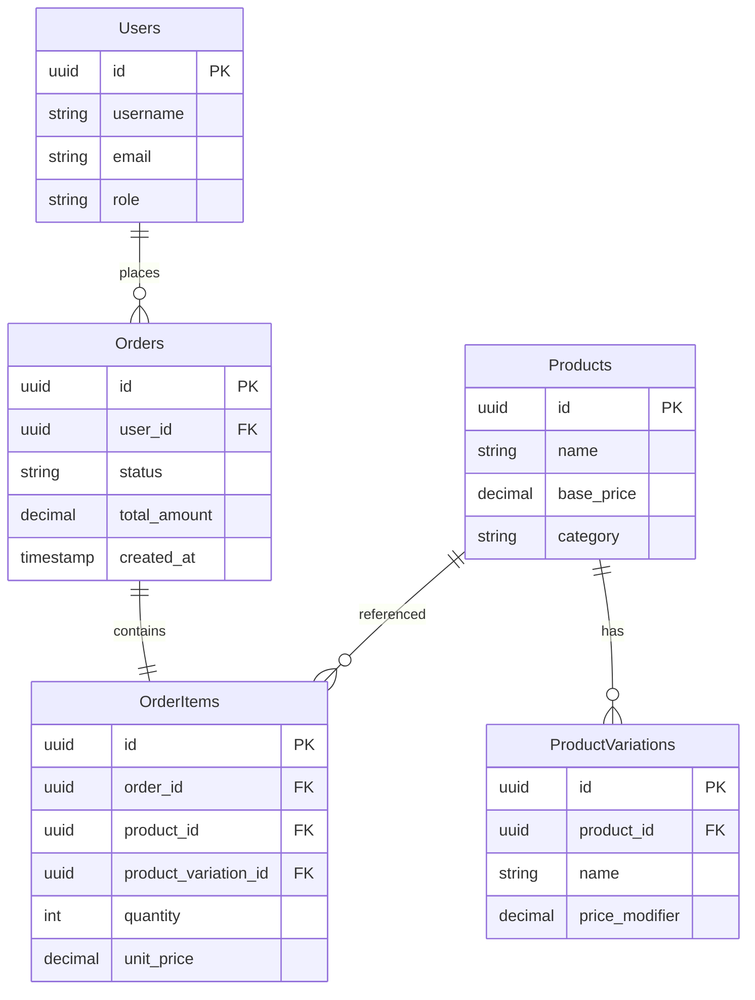

# CoffeeShop.Order Data Models

## Entity Relationship Diagram



## PostgreSQL Database Schema

### Users Table
```sql
CREATE TABLE Users (
    Id UUID PRIMARY KEY,
    Username VARCHAR(100) UNIQUE NOT NULL,
    Email VARCHAR(255) UNIQUE NOT NULL,
    PasswordHash VARCHAR(255) NOT NULL,
    Role VARCHAR(50) NOT NULL,
    CreatedAt TIMESTAMP WITH TIME ZONE DEFAULT NOW(),
    LastLoginAt TIMESTAMP WITH TIME ZONE
);
```

### Products Table
```sql
CREATE TABLE Products (
    Id UUID PRIMARY KEY,
    Name VARCHAR(255) NOT NULL,
    BasePrice DECIMAL(10, 2) NOT NULL,
    Category VARCHAR(100) NOT NULL
);

CREATE TABLE ProductVariations (
    Id UUID PRIMARY KEY,
    ProductId UUID REFERENCES Products(Id),
    Name VARCHAR(100) NOT NULL,
    PriceModifier DECIMAL(10, 2) DEFAULT 0
);
```

### Orders Table
```sql
CREATE TABLE Orders (
    Id UUID PRIMARY KEY,
    UserId UUID REFERENCES Users(Id),
    Status VARCHAR(50) NOT NULL,
    TotalAmount DECIMAL(10, 2) NOT NULL,
    CreatedAt TIMESTAMP WITH TIME ZONE DEFAULT NOW(),
    UpdatedAt TIMESTAMP WITH TIME ZONE
);

CREATE TABLE OrderItems (
    Id UUID PRIMARY KEY,
    OrderId UUID REFERENCES Orders(Id),
    ProductId UUID REFERENCES Products(Id),
    ProductVariationId UUID REFERENCES ProductVariations(Id),
    Quantity INTEGER NOT NULL,
    UnitPrice DECIMAL(10, 2) NOT NULL
);
```

## Domain Entities

### Order Entity
```csharp
public class Order : AggregateRoot<OrderId>
{
    public CustomerId CustomerId { get; private set; }
    public OrderStatus Status { get; private set; }
    public Money TotalAmount { get; private set; }
    private List<OrderItem> _items = new();

    public void AddItem(Product product, ProductVariation variation, int quantity)
    {
        var unitPrice = product.BasePrice + (variation?.PriceModifier ?? 0);
        var orderItem = new OrderItem(product, variation, quantity, unitPrice);
        _items.Add(orderItem);
        RecalculateTotalAmount();
    }

    private void RecalculateTotalAmount()
    {
        TotalAmount = _items.Sum(item => item.UnitPrice * item.Quantity);
    }
}
```

### Value Objects
```csharp
public record Money(decimal Amount, string Currency = "USD")
{
    public static Money operator +(Money a, Money b) =>
        a with { Amount = a.Amount + b.Amount };

    public static Money operator *(Money money, int quantity) =>
        money with { Amount = money.Amount * quantity };
}

public record ProductSnapshot(
    ProductId Id,
    string Name,
    Money Price,
    ProductVariation Variation = null
);
```

## Initial Data Seeding

### Product Catalog Seeding
```sql
-- Seed Products
INSERT INTO Products (Id, Name, BasePrice, Category) VALUES
    (gen_random_uuid(), 'Latte', 4.00, 'Coffee'),
    (gen_random_uuid(), 'Espresso', 2.50, 'Coffee'),
    (gen_random_uuid(), 'Macchiato', 4.00, 'Coffee'),
    (gen_random_uuid(), 'Iced Coffee', 3.50, 'Coffee'),
    (gen_random_uuid(), 'Donut', 2.00, 'Pastry');

-- Seed Product Variations
INSERT INTO ProductVariations (Id, ProductId, Name, PriceModifier) VALUES
    (gen_random_uuid(), (SELECT Id FROM Products WHERE Name = 'Latte'), 'Pumpkin Spice', 0.50),
    (gen_random_uuid(), (SELECT Id FROM Products WHERE Name = 'Latte'), 'Vanilla', 0.30),
    (gen_random_uuid(), (SELECT Id FROM Products WHERE Name = 'Espresso'), 'Double Shot', 1.00);
```

## Migration Strategy

### Key Considerations
- UUID for primary keys
- Timezone-aware timestamps
- Normalized product and variation structure
- Flexible pricing model
- Support for complex order compositions

### Performance Optimizations
- Appropriate indexing
- Partial indexes for frequently queried subsets
- Potential materialized views for reporting
- Consider horizontal partitioning for large tables