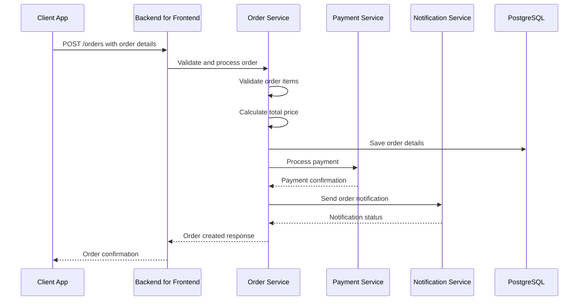
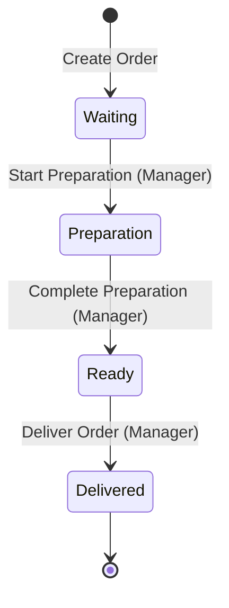

# CoffeeShop.Order Detailed Architecture

## Trio Coffee Shop Challenge Description

The Trio Challenge consists of creating a RESTful coffee shop order management application.

### Getting Started

This application needs to support two types of users: **Managers** and **Customers**.

- **Managers** have full access to all features.
- **Customers** have limited access and cannot perform managerial actions.

To simulate role-based access, requests should include a role header with one of the following values:

```
role: customer
role: manager
```

### Managers

Orders can have one of the four statuses: **Waiting**, **Preparation**, **Ready**, and **Delivered**.

Status transitions must follow this strict sequence:
**Status Flow**: Waiting → Preparation → Ready → Delivered

### Customers

Order and customize their orders with several options from the catalog below.

### Catalog with Pricing

| Product | Base Price | Variation | Price Change |
|---------|-----------|-----------|--------------|
| Latte | $4.00 | Pumpkin Spice | +$0.50 |
| Latte | $4.00 | Vanilla | +$0.30 |
| Latte | $4.00 | Hazelnut | +$0.40 |
| Espresso | $2.50 | Single Shot | +$0.00 |
| Espresso | $2.50 | Double Shot | +$1.00 |
| Macchiato | $4.00 | Caramel | +$0.50 |
| Macchiato | $4.00 | Vanilla | +$0.30 |
| Iced Coffee | $3.50 | Regular | +$0.00 |
| Iced Coffee | $3.50 | Sweetened | +$0.30 |
| Iced Coffee | $3.50 | Extra Ice | +$0.20 |
| Donuts | $2.00 | Glazed | +$0.00 |
| Donuts | $2.00 | Jelly | +$0.30 |
| Donuts | $2.00 | Boston Cream | +$0.50 |

### Required Endpoints

#### 1. GET /menu — View Menu
Returns a complete list of products with:
- Base prices
- All available variations
- Price changes for each variation (as shown in the catalog)

#### 2. POST /orders — Place a New Order
- Accepts a list of products and their variations
- Calculates the total price based on base price + variation price
- **Critical Requirement**: Integrates with the payment service:
  - `POST https://challenge.trio.dev/api/v1/payment`
  - `{"value": TOTAL_AMOUNT}`
  - Displays full payment service response in the terminal
  - Order is only created if the payment is successful
  - All orders are initialized with the status: **Waiting**
  - Returns appropriate error if payment fails

#### 3. GET /orders/{id} — View Order Details
Returns full information for a specific order:
- All ordered items and their variations
- Individual item pricing
- Total order price
- Current order status
- Order creation timestamp

#### 4. PATCH /orders/{id}/status — Update Order Status
- **Manager Only**: Enforces role-based access control
- Status transitions must follow strictly:
  - **Status Flow**: Waiting → Preparation → Ready → Delivered
- **Critical Requirement**: Integrates with the notification service:
  - `POST https://challenge.trio.dev/api/v1/notification`
  - `{"status": "{ORDER_STATUS}"}`
  - Displays full notification response in the terminal

## Order Creation Sequence Diagram



## Clean Architecture Layer Structure

```
CoffeeShop.Order/
├── Domain/
│   ├── Entities/
│   │   ├── Order.cs
│   │   └── OrderItem.cs
│   ├── ValueObjects/
│   │   ├── Money.cs
│   │   ├── Quantity.cs
│   │   └── ProductSnapshot.cs
│   ├── Aggregates/
│   │   └── OrderAggregate.cs
│   ├── DomainEvents/
│   │   ├── OrderCreatedEvent.cs
│   │   └── OrderStatusChangedEvent.cs
│   └── Enums/
│       └── OrderStatus.cs
├── Application/
│   ├── Commands/
│   │   ├── CreateOrderCommand.cs
│   │   └── UpdateOrderStatusCommand.cs
│   ├── Queries/
│   │   ├── GetMenuQuery.cs
│   │   └── GetOrderByIdQuery.cs
│   ├── DTOs/
│   │   ├── OrderDto.cs
│   │   └── OrderItemDto.cs
│   └── Interfaces/
│       └── IOrderRepository.cs
├── Infrastructure/
│   ├── Persistence/
│   │   └── OrderRepository.cs
│   ├── ExternalServices/
│   │   ├── PaymentService.cs
│   │   └── NotificationService.cs
│   └── Repositories/
│       └── PostgreSqlOrderRepository.cs
└── Presentation/
    └── Controllers/
        └── OrderController.cs
```

## Domain Model

### Order Entity
```csharp
public class Order : AggregateRoot<OrderId>
{
    public CustomerId CustomerId { get; private set; }
    public OrderStatus Status { get; private set; }
    public Money TotalAmount { get; private set; }
    private List<OrderItem> _items = new();

    public void AddItem(Product product, int quantity) { /* ... */ }
    public void UpdateStatus(OrderStatus newStatus) { /* ... */ }
    public void CalculateTotalPrice() { /* ... */ }
}
```

### Value Objects
```csharp
public record Money(decimal Amount, string Currency);
public record ProductSnapshot(ProductId Id, string Name, Money Price);
```

## CQRS Structure

### Commands
```csharp
public record CreateOrderCommand(
    CustomerId CustomerId,
    List<OrderItemDto> Items
) : IRequest<OrderId>;

public record UpdateOrderStatusCommand(
    OrderId OrderId,
    OrderStatus NewStatus
) : IRequest<Unit>;
```

### Queries
```csharp
public record GetMenuQuery : IRequest<List<ProductDto>>;
public record GetOrderByIdQuery(OrderId OrderId) : IRequest<OrderDto>;
```

## External Service Integration

### Payment Service Integration
```csharp
public class PaymentService
{
    private readonly DaprClient _daprClient;

    public async Task<PaymentResult> ProcessPayment(Order order)
    {
        return await _daprClient.InvokeMethodAsync<PaymentRequest, PaymentResult>(
            "payment-service",
            "process-payment",
            new PaymentRequest { /* ... */ }
        );
    }
}
```

## Order Status Transition Workflow



## Key Design Decisions
- Immutable domain entities
- Explicit consistency boundaries
- Event-driven domain model
- Comprehensive validation
- Resilient external service communication
- Strict order status transitions

## Pricing Calculation Strategy
- Base product price
- Variation price modifiers
- Validation of pricing rules
- Immutable price calculations

## Validation Rules
- Prevent invalid order creation
- Enforce business rules
- Validate product availability
- Check customer roles for status changes

## Dapr Service Integration
- Circuit breaker for Payment service
- Retry mechanisms
- Timeout configurations
- Async communication patterns