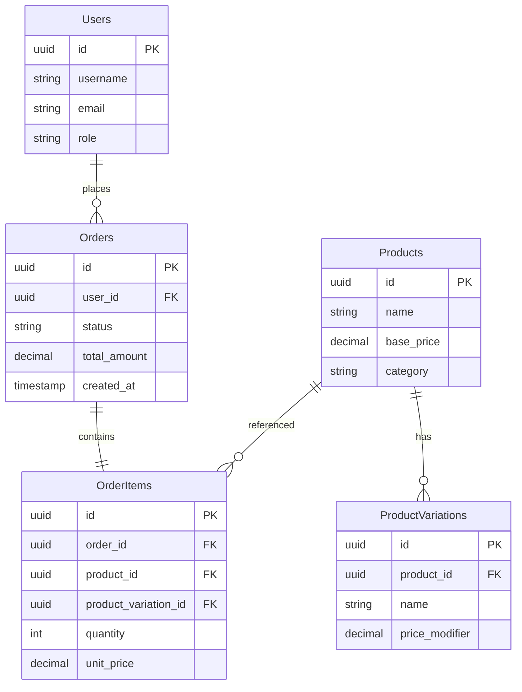

# CoffeeShop.Order Data Models

## Entity Relationship Diagram

## Entity Descriptions

### Users Entity
Denormalized user data synchronized from Identity service via Kafka events for local order operations.

**Key Attributes:**
- `id` (UUID, PK): Unique identifier synchronized from Identity service
- `username` (string): User's display name
- `email` (string): User's email address
- `role` (string): Access level - "customer" or "manager"

**Synchronization Strategy:**
- Data replicated via eventual consistency from Identity service
- Order service subscribes to Kafka events: `user.created`, `user.updated`, `user.deleted`
- Local copy eliminates need for real-time Identity service queries during order operations
- Updates applied asynchronously when user events are received

**Business Rules:**
- Users cannot be created or updated directly in Order service
- All user mutations happen in Identity service and propagate via events
- Role determines order authorization (customers: own orders, managers: all orders)

**Relationships:**
- One user can place many orders (1:N with Orders)

---

### Orders Entity
Core aggregate representing a customer's coffee shop order with complete lifecycle tracking.

**Key Attributes:**
- `id` (UUID, PK): Unique order identifier
- `user_id` (UUID, FK): Reference to the customer who placed the order
- `status` (string): Current order state - "Waiting", "Preparation", "Ready", or "Delivered"
- `total_amount` (decimal): Calculated total price including all items and variations
- `created_at` (timestamp): Order creation timestamp for tracking and sorting

**Business Rules:**
- Status transitions must follow strict sequence: Waiting → Preparation → Ready → Delivered
- Total amount is immutable once payment succeeds
- Only created after successful payment confirmation
- Managers can update status, customers can only view

**Relationships:**
- Belongs to one user (N:1 with Users)
- Contains one or more order items (1:N with OrderItems)

---

### OrderItems Entity
Line items representing individual products and their variations within an order.

**Key Attributes:**
- `id` (UUID, PK): Unique line item identifier
- `order_id` (UUID, FK): Parent order reference
- `product_id` (UUID, FK): Reference to the ordered product
- `product_variation_id` (UUID, FK): Specific variation selected (nullable if product has no variations)
- `quantity` (int): Number of items ordered
- `unit_price` (decimal): Snapshot of the calculated price at order time (base + variation)

**Business Rules:**
- Unit price captures base_price + price_modifier at order time
- Price is immutable to preserve historical accuracy
- Quantity must be positive integer
- Each line item represents one product-variation combination

**Relationships:**
- Belongs to one order (N:1 with Orders)
- References one product (N:1 with Products)
- References one product variation (N:1 with ProductVariations, optional)

---

### Products Entity
Catalog of available coffee shop products with base pricing information.

**Key Attributes:**
- `id` (UUID, PK): Unique product identifier
- `name` (string): Product name (e.g., "Latte", "Espresso", "Donuts")
- `base_price` (decimal): Starting price before variations applied
- `category` (string): Product classification for organization and filtering

**Business Rules:**
- Products are read-only from customer perspective
- Base price is the foundation for all price calculations
- Product catalog is pre-seeded via migrations
- Names should be unique within categories

**Relationships:**
- Has zero or more variations (1:N with ProductVariations)
- Referenced by order items (1:N with OrderItems)

---

### ProductVariations Entity
Customization options for products with associated price modifiers.

**Key Attributes:**
- `id` (UUID, PK): Unique variation identifier
- `product_id` (UUID, FK): Parent product reference
- `name` (string): Variation name (e.g., "Vanilla", "Double Shot", "Glazed")
- `price_modifier` (decimal): Amount to add to base price (can be 0.00 for default options)

**Business Rules:**
- Price modifier is added to product base price
- Multiple variations can exist per product
- Variation catalog is pre-seeded via migrations
- Price modifiers are always additive (no negative values)

**Relationships:**
- Belongs to one product (N:1 with Products)
- Referenced by order items (1:N with OrderItems)

---

## Migration Strategy

### Key Considerations
- UUID for primary keys
- Timezone-aware timestamps
- Normalized product and variation structure
- Flexible pricing model
- Support for complex order compositions

### Performance Optimizations
- Appropriate indexing
- Partial indexes for frequently queried subsets
- Potential materialized views for reporting
- Consider horizontal partitioning for large tables