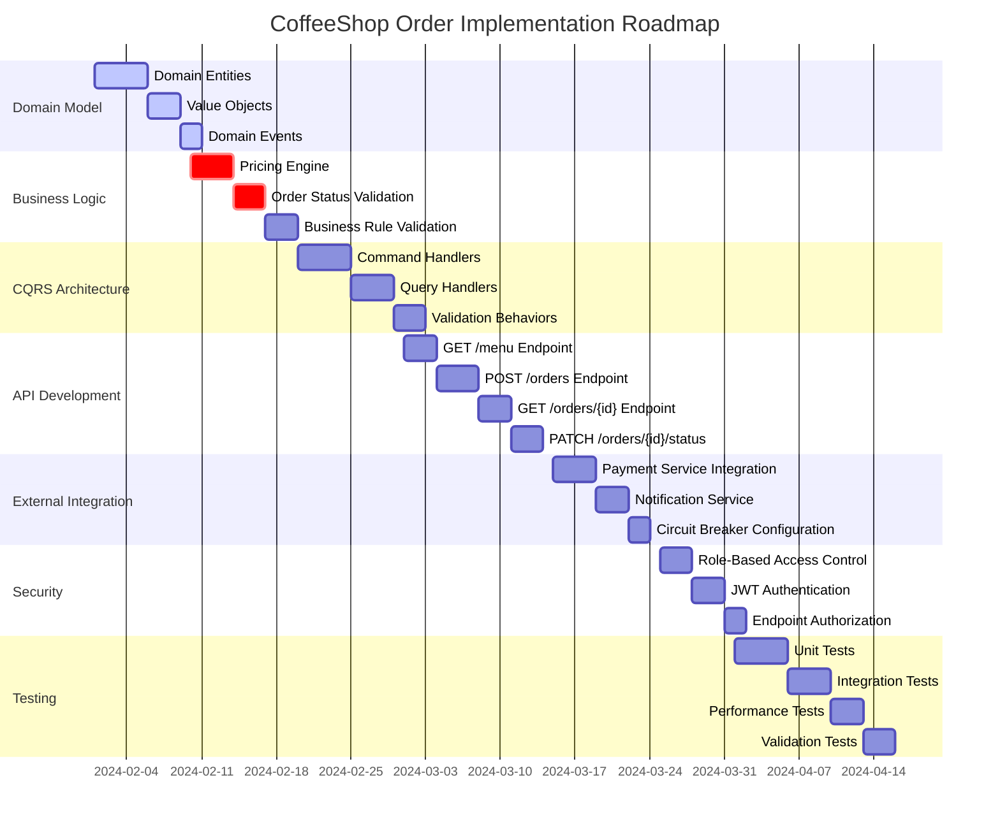

# CoffeeShop.Order Implementation Plan

## Implementation Phases

## Detailed Implementation Checklist

### Phase 1: Domain Model & Entities
- [ ] Create `Order` aggregate root
- [ ] Implement `OrderItem` entity
- [ ] Define `Money` value object
- [ ] Create `ProductSnapshot` value object
- [ ] Design order status state machine
- [ ] Implement immutable domain entities

### Phase 2: Pricing Calculation Engine
- [ ] Design pricing calculation strategy
- [ ] Implement base price calculation
- [ ] Add support for product variations
- [ ] Create total price calculation method
- [ ] Validate pricing rules
- [ ] Add pricing validation tests

### Phase 3: CQRS Commands/Queries
- [ ] Implement `CreateOrderCommand`
- [ ] Create `UpdateOrderStatusCommand`
- [ ] Design `GetMenuQuery`
- [ ] Implement `GetOrderByIdQuery`
- [ ] Add command and query handlers
- [ ] Implement MediatR pipeline behaviors

### Phase 4: API Endpoints
- [ ] Develop `GET /menu` endpoint
  - Retrieve product catalog with variations
- [ ] Implement `POST /orders` endpoint
  - Validate order items
  - Calculate total price
  - Save order details
- [ ] Create `GET /orders/{id}` endpoint
  - Retrieve order details
  - Support role-based access
- [ ] Build `PATCH /orders/{id}/status` endpoint
  - Update order status
  - Manager role restriction

### Phase 5: External Service Integration
- [ ] Implement Payment service integration
  - Configure Dapr service invocation
  - Add circuit breaker
  - Implement retry mechanism
- [ ] Create Notification service integration
  - Send order notifications
  - Handle notification failures

### Phase 6: Role-Based Access Control
- [ ] Configure JWT token parsing
- [ ] Implement role extraction from headers
- [ ] Add authorization filters
- [ ] Create custom authorization attributes
- [ ] Validate role-specific access rules

### Phase 7: Status Transition Validation
- [ ] Define valid order status transitions
- [ ] Implement status change validation
- [ ] Create domain logic for status updates
- [ ] Add domain event for status changes
- [ ] Implement compensation strategies

### Phase 8: Testing & Validation
- [ ] Write unit tests for domain entities
- [ ] Create integration tests for API endpoints
- [ ] Implement performance benchmark tests
- [ ] Add chaos testing for external services
- [ ] Validate error handling scenarios

## Success Criteria
- [ ] All endpoints working as specified
- [ ] 90% code coverage
- [ ] Comprehensive logging and tracing
- [ ] Resilient external service communication