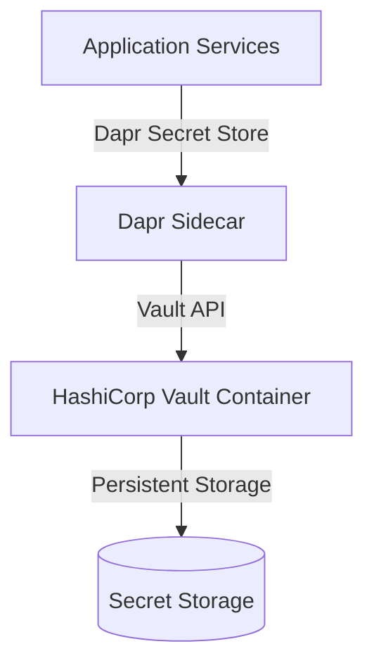

# CoffeeShop Secret Store Architecture

## Overview
Replace Azure Key Vault with self-hosted HashiCorp Vault for centralized secret management.

## Architecture Diagram


## Vault Initialization Strategy
1. **Initialization Script**
```bash
#!/bin/bash
vault operator init \
    -key-shares=5 \
    -key-threshold=3 \
    -format=json > /vault/config/init.json

# Store unseal keys and root token securely
```

2. **Unsealing Mechanism**
```bash
#!/bin/bash
VAULT_ADDR='http://localhost:8200'
UNSEAL_KEY=$(jq -r '.unseal_keys_b64[0]' /vault/config/init.json)
vault operator unseal $UNSEAL_KEY
```

## Dockerfile Strategy
```dockerfile
FROM hashicorp/vault:latest

COPY config/vault-config.hcl /vault/config/vault-config.hcl
COPY scripts/init-vault.sh /vault/scripts/init-vault.sh
COPY scripts/unseal-vault.sh /vault/scripts/unseal-vault.sh

RUN chmod +x /vault/scripts/*.sh

EXPOSE 8200
CMD ["vault", "server", "-config=/vault/config/vault-config.hcl"]
```

## Dapr Secret Store Component
```yaml
apiVersion: dapr.io/v1alpha1
kind: Component
metadata:
  name: vault-secret-store
spec:
  type: secretstores.hashicorp.vault
  metadata:
  - name: vaultAddr
    value: "http://vault:8200"
  - name: vaultToken
    value: "${VAULT_TOKEN}"
```

## Secret Hierarchy Design
```
secrets/
├── development/
│   ├── identity/
│   │   ├── connection_string
│   │   └── jwt_secret
│   └── order/
│       ├── database_password
│       └── external_service_key
├── staging/
└── production/
```

## Security Considerations
- Least privilege principle
- Regular key rotation
- Audit logging
- Encrypted transit
- Multi-layer unsealing process

## Integration Points
- .NET Aspire AppHost Container Resource
- Dapr Secret Store Component
- Kubernetes/Docker Deployment
- Development vs Production configurations