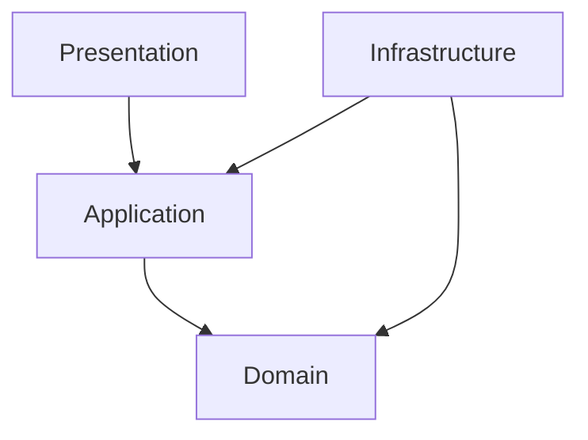
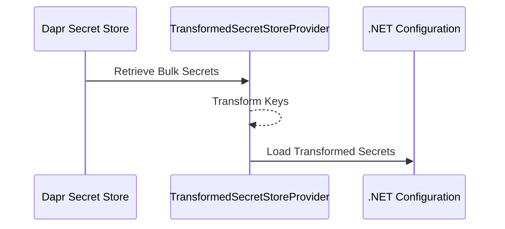
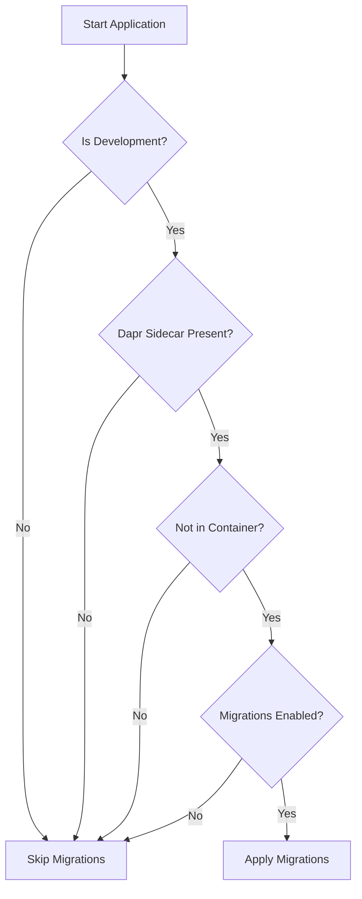

# Architectural Patterns Implementation Guide

## Domain-Driven Design (DDD) Layer Structure

### Responsibilities
- **Domain Layer**: Pure business logic, entities, value objects
- **Application Layer**: Use cases, orchestration, DTO mapping
- **Infrastructure Layer**: External concerns, persistence, services
- **Presentation Layer**: HTTP endpoints, controllers

### Layer Interaction Rules
- Domain layer is independent
- Application layer depends on domain
- Infrastructure depends on application
- Presentation depends on application

## Clean Architecture Implementation



## CQRS with MediatR Pipeline

### Pipeline Behaviors
```csharp
public class ValidationBehavior<TRequest, TResponse> : IPipelineBehavior<TRequest, TResponse>
{
    public async Task<TResponse> Handle(
        TRequest request,
        RequestHandlerDelegate<TResponse> next,
        CancellationToken cancellationToken)
    {
        // Validate request
        // Log request
        // Handle exceptions
        return await next();
    }
}
```

### Validation with FluentValidation
```csharp
public class CreateOrderCommandValidator : AbstractValidator<CreateOrderCommand>
{
    public CreateOrderCommandValidator()
    {
        RuleFor(x => x.CustomerId).NotEmpty();
        RuleFor(x => x.Items).NotEmpty();
        RuleForEach(x => x.Items)
            .SetValidator(new OrderItemValidator());
    }
}
```

## AutoMapper Configuration
```csharp
public class MappingProfile : Profile
{
    public MappingProfile()
    {
        CreateMap<Order, OrderDto>()
            .ForMember(d => d.TotalAmount,
                       opt => opt.MapFrom(s => s.TotalAmount.Amount));

        CreateMap<CreateOrderCommand, Order>();
    }
}
```

## Exception Middleware (Problem Details)
```csharp
public class ExceptionMiddleware
{
    public async Task InvokeAsync(HttpContext context, RequestDelegate next)
    {
        try
        {
            await next(context);
        }
        catch (Exception ex)
        {
            context.Response.StatusCode = GetStatusCode(ex);
            await context.Response.WriteAsJsonAsync(new ProblemDetails
            {
                Title = "An error occurred",
                Detail = ex.Message,
                Status = context.Response.StatusCode
            });
        }
    }
}
```

## Dapr Client Patterns
```csharp
public class PaymentService
{
    private readonly DaprClient _daprClient;

    public async Task ProcessPayment(PaymentRequest request)
    {
        await _daprClient.InvokeMethodAsync(
            HttpMethod.Post,
            "payment-service",
            "process",
            request
        );
    }
}
```

## Dapr Secret Store Integration
```csharp
public class SecretService
{
    private readonly DaprClient _daprClient;

    public async Task<string> GetSecret(string secretName)
    {
        var secret = await _daprClient.GetSecretAsync(
            "azure-keyvault",
            secretName
        );
        return secret[secretName];
    }
}
```

## Key Implementation Guidelines
- Immutable domain entities
- Explicit consistency boundaries
- Comprehensive input validation
- Centralized error handling
- Distributed tracing support
- Performance-oriented design

## Anti-Patterns to Avoid
- Anemic domain models
- Tight coupling between layers
- Excessive infrastructure dependencies
- Lack of clear separation of concerns

## Recommended Configuration
```csharp
public void ConfigureServices(IServiceCollection services)
{
    services.AddMediatR(cfg => {
        cfg.RegisterServicesFromAssembly(typeof(Startup).Assembly);
        cfg.AddOpenBehavior(typeof(ValidationBehavior<,>));
        cfg.AddOpenBehavior(typeof(LoggingBehavior<,>));
    });

    services.AddValidatorsFromAssembly(typeof(Startup).Assembly);
    services.AddAutoMapper(typeof(Startup));
    services.AddDaprClient();
}
```

## Performance Considerations
- Minimal abstraction overhead
- Efficient dependency injection
- Lightweight middleware
- Optimized serialization
- Caching strategies


## Dapr Secret Management Pattern

### Purpose
The TransformedSecretStoreProvider pattern enables seamless integration of Dapr secret stores with .NET Configuration, providing a robust and flexible approach to secret management.

### Key Features
- Automatic secret transformation from Dapr store
- Key conversion from `key--key` to `key:key` format
- Graceful error handling
- Development-environment focused loading

#### Secret Transformation Flow



### Implementation Considerations
- Supports bulk secret retrieval
- Prevents application startup failures
- Configurable per environment
- Secure secret handling

### Configuration Override
```json
{
  "SecretStore": {
    "Provider": "Dapr",
    "Environment": "Development"
  }
}
```

## Database Persistence Pattern

### Purpose
The PersistenceExtensions pattern standardizes database setup and migration processes across development environments.

### Key Features
- Automatic database migration in development
- Multi-DbContext support
- Environment-aware migration strategies
- Configurable migration behavior

#### Migration Decision Flow



### Migration Safety Rules
- Migrations only in Development environment
- Requires Dapr sidecar
- Disabled in containerized environments
- Configurable via application settings

### Configuration Override
```json
{
  "Database": {
    "AutoMigrations": {
      "Enabled": true
    }
  }
}
```

## ServiceDefaults Integration

### Purpose
Centralize cross-cutting concerns and provide consistent service configuration across microservices.

### Integration Points
- Secret Management
- Database Persistence
- Logging
- Telemetry
- Health Checks

### Dapr and Persistence Requirements
- Dapr sidecar must be running
- Connection strings managed via secret store
- Development migrations automated
- Production migrations managed separately

## Implementation Checklist

### TransformedSecretStoreProvider
- [ ] Create provider implementation
- [ ] Configure Dapr secret store
- [ ] Test secret transformation
- [ ] Implement error handling

### PersistenceExtensions
- [ ] Create migration extensions
- [ ] Add environment checks
- [ ] Configure DbContext registration
- [ ] Test migration strategies

## Troubleshooting

### Common Issues
1. **Migration Failures**
   - Check database connectivity
   - Verify Dapr sidecar configuration
   - Ensure migration connection strings

2. **Secret Loading Problems**
   - Validate Dapr secret store component
   - Check key transformation rules
   - Review environment-specific configurations

## References
- Dapr Documentation
- .NET Configuration Provider
- Entity Framework Core Migrations