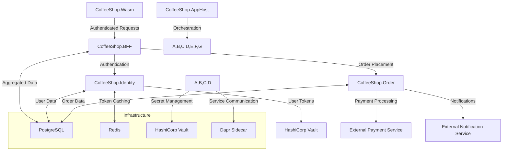

# Coffee Shop Order Management - System Architecture Overview

## System Architecture Diagram

## Key Architectural Changes
- **BFF as API Gateway**: All frontend requests now route through CoffeeShop.BFF
- **Replaced Azure Key Vault with HashiCorp Vault**
- **Enhanced Secret Management with Dapr Secret Store Component**

## Updated Application Responsibilities

### CoffeeShop.BFF (Enhanced Role)
- Acts as primary API Gateway
- Implements request routing and transformation
- Handles token validation and forwarding
- Aggregates responses from multiple services
- Provides optimized, secure API for frontend

### CoffeeShop.SecretStore (New Component)
- Self-hosted secret management using HashiCorp Vault
- Centralized secret storage and retrieval
- Secure initialization and unsealing strategies
- Integrates with Dapr Secret Store Component

## Technology Stack Updates
- **Secret Management**: HashiCorp Vault (replaced Azure Key Vault)
- **API Gateway Pattern**: Implemented with enhanced BFF
- **Service Communication**: Maintained Dapr integration
- **Orchestration**: Continued .NET Aspire support

## Security Architecture Enhancements
- Centralized secret management via HashiCorp Vault
- Enhanced token handling through BFF
- Reduced direct service exposure
- Improved request validation at gateway layer

## Communication Patterns
- BFF acts as request aggregation and transformation layer
- OAuth2/OIDC authentication preserved
- Dapr for service invocation maintained
- Enhanced distributed tracing capabilities

## Infrastructure Scalability
- Stateless service design maintained
- BFF provides additional scalability layer
- Improved secret management flexibility
- Cloud-native architecture preserved