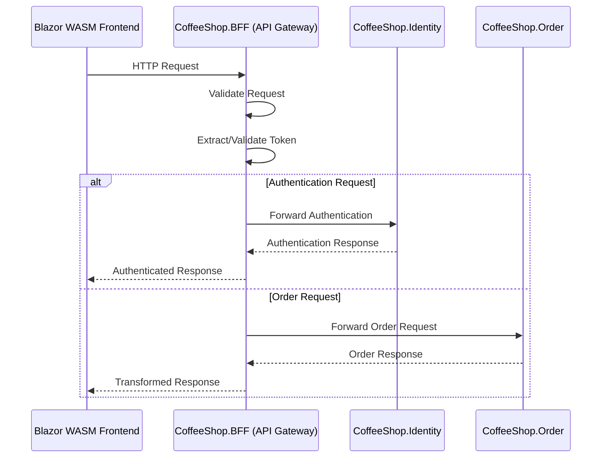

# CoffeeShop BFF (Backend for Frontend) Architecture

## Overview
The Backend for Frontend (BFF) serves as an API Gateway and intermediary layer between the Blazor WebAssembly (WASM) frontend and backend microservices.

## Architecture Pattern
### BFF as API Gateway



## Key Responsibilities
1. **Request Routing**
   - Intelligently route requests to appropriate microservices
   - Implement path-based routing strategies

2. **Token Management**
   - Extract authentication tokens
   - Validate token integrity
   - Forward authenticated requests
   - Handle token refresh mechanisms

3. **Request/Response Transformation**
   - Aggregate responses from multiple services
   - Standardize response formats
   - Add cross-cutting concerns (logging, monitoring)

## Routing Configuration
```csharp
public void ConfigureServices(IServiceCollection services)
{
    services.AddReverseProxy()
        .LoadFromConfig(Configuration.GetSection("ReverseProxy"));
}

// appsettings.json routing configuration
{
    "ReverseProxy": {
        "Routes": [
            {
                "RouteId": "auth-route",
                "ClusterId": "identity-cluster",
                "Match": { "Path": "/api/auth/{**catch-all}" }
            },
            {
                "RouteId": "order-route",
                "ClusterId": "order-cluster",
                "Match": { "Path": "/api/orders/{**catch-all}" }
            }
        ]
    }
}
```

## Security Considerations
- HTTPS-only communication
- Token validation middleware
- Rate limiting
- CORS configuration
- Minimal attack surface exposure

## Performance Optimizations
- Caching response fragments
- Request aggregation
- Minimal overhead routing
- Efficient token management