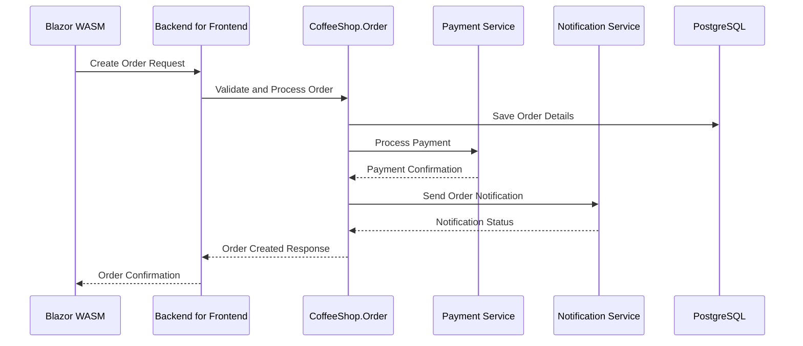

# CoffeeShop.Order - Order Management Architecture

## Order Creation Sequence Diagram



## Clean Architecture Layer Structure

```
CoffeeShop.Order/
├── Domain/
│   ├── Entities/
│   ├── ValueObjects/
│   ├── Aggregates/
│   └── DomainEvents/
├── Application/
│   ├── Commands/
│   ├── Queries/
│   ├── DTOs/
│   └── Interfaces/
├── Infrastructure/
│   ├── Persistence/
│   ├── ExternalServices/
│   └── Repositories/
└── Presentation/
    └── Controllers/
```

## Domain Model

### Entities
```csharp
public class Order : AggregateRoot<OrderId>
{
    public CustomerId CustomerId { get; private set; }
    public OrderStatus Status { get; private set; }
    public Money TotalAmount { get; private set; }
    private List<OrderItem> _items = new();

    public void AddItem(Product product, int quantity) { /* ... */ }
    public void UpdateStatus(OrderStatus newStatus) { /* ... */ }
}

public class OrderItem : Entity<OrderItemId>
{
    public ProductId ProductId { get; private set; }
    public ProductSnapshot Product { get; private set; }
    public Quantity Quantity { get; private set; }
    public Money UnitPrice { get; private set; }
}
```

### Value Objects
```csharp
public record Money(decimal Amount, string Currency);
public record Quantity(int Value);
public record ProductSnapshot(
    ProductId Id,
    string Name,
    Money Price,
    List<ProductVariation> Variations
);
```

## CQRS Structure

### Commands
```csharp
public record CreateOrderCommand(
    CustomerId CustomerId,
    List<OrderItemDto> Items
) : IRequest<OrderId>;

public record UpdateOrderStatusCommand(
    OrderId OrderId,
    OrderStatus NewStatus
) : IRequest<Unit>;
```

### Queries
```csharp
public record GetMenuQuery : IRequest<List<ProductDto>>;
public record GetOrderByIdQuery(OrderId OrderId) : IRequest<OrderDto>;
```

## External Service Integration
- Payment Service Integration
  - Dapr service invocation
  - Resilience policies
  - Timeout and circuit breaker configuration

```csharp
public class PaymentService
{
    private readonly DaprClient _daprClient;

    public async Task<PaymentResult> ProcessPayment(Order order)
    {
        return await _daprClient.InvokeMethodAsync<PaymentRequest, PaymentResult>(
            "payment-service",
            "process-payment",
            new PaymentRequest { /* ... */ }
        );
    }
}
```

## PostgreSQL Schema
```sql
CREATE TABLE Orders (
    Id UUID PRIMARY KEY,
    CustomerId UUID NOT NULL,
    Status VARCHAR(50) NOT NULL,
    TotalAmount DECIMAL(18,2) NOT NULL,
    CreatedAt TIMESTAMP DEFAULT NOW()
);

CREATE TABLE OrderItems (
    Id UUID PRIMARY KEY,
    OrderId UUID REFERENCES Orders(Id),
    ProductId UUID NOT NULL,
    Quantity INT NOT NULL,
    UnitPrice DECIMAL(18,2) NOT NULL
);
```

## Key Design Decisions
- Domain-Driven Design approach
- Immutable domain entities
- Explicit consistency boundaries
- Event-driven domain model
- Separation of read and write models
- Comprehensive validation
- Resilient external service communication