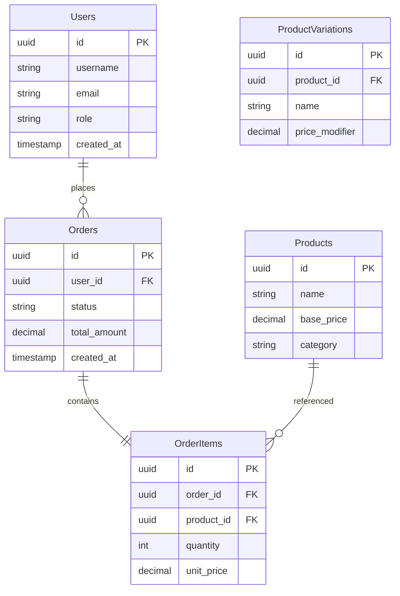

# Coffee Shop Data Models and Database Schema

## Entity Relationship Diagram



## PostgreSQL Schema Definitions

### Identity Database

```sql
-- Users Table
CREATE TABLE Users (
    Id UUID PRIMARY KEY,
    Username VARCHAR(100) UNIQUE NOT NULL,
    Email VARCHAR(255) UNIQUE NOT NULL,
    PasswordHash VARCHAR(255) NOT NULL,
    Role VARCHAR(50) NOT NULL,
    CreatedAt TIMESTAMP WITH TIME ZONE DEFAULT NOW(),
    LastLoginAt TIMESTAMP WITH TIME ZONE
);

-- User Claims
CREATE TABLE UserClaims (
    Id UUID PRIMARY KEY,
    UserId UUID REFERENCES Users(Id),
    ClaimType VARCHAR(100) NOT NULL,
    ClaimValue VARCHAR(500)
);
```

### Order Database

```sql
-- Products Table
CREATE TABLE Products (
    Id UUID PRIMARY KEY,
    Name VARCHAR(255) NOT NULL,
    BasePrice DECIMAL(10, 2) NOT NULL,
    Category VARCHAR(100) NOT NULL
);

-- Product Variations
CREATE TABLE ProductVariations (
    Id UUID PRIMARY KEY,
    ProductId UUID REFERENCES Products(Id),
    Name VARCHAR(100) NOT NULL,
    PriceModifier DECIMAL(10, 2) DEFAULT 0
);

-- Orders Table
CREATE TABLE Orders (
    Id UUID PRIMARY KEY,
    UserId UUID REFERENCES Users(Id),
    Status VARCHAR(50) NOT NULL,
    TotalAmount DECIMAL(10, 2) NOT NULL,
    CreatedAt TIMESTAMP WITH TIME ZONE DEFAULT NOW(),
    UpdatedAt TIMESTAMP WITH TIME ZONE
);

-- Order Items
CREATE TABLE OrderItems (
    Id UUID PRIMARY KEY,
    OrderId UUID REFERENCES Orders(Id),
    ProductId UUID REFERENCES Products(Id),
    ProductVariationId UUID REFERENCES ProductVariations(Id),
    Quantity INTEGER NOT NULL,
    UnitPrice DECIMAL(10, 2) NOT NULL
);
```

## Initial Data Seeding

```sql
-- Seed Products
INSERT INTO Products (Id, Name, BasePrice, Category) VALUES
    (gen_random_uuid(), 'Latte', 4.00, 'Coffee'),
    (gen_random_uuid(), 'Espresso', 2.50, 'Coffee'),
    (gen_random_uuid(), 'Macchiato', 4.00, 'Coffee'),
    (gen_random_uuid(), 'Iced Coffee', 3.50, 'Coffee'),
    (gen_random_uuid(), 'Donut', 2.00, 'Pastry');

-- Seed Product Variations
INSERT INTO ProductVariations (Id, ProductId, Name, PriceModifier) VALUES
    (gen_random_uuid(), (SELECT Id FROM Products WHERE Name = 'Latte'), 'Pumpkin Spice', 0.50),
    (gen_random_uuid(), (SELECT Id FROM Products WHERE Name = 'Latte'), 'Vanilla', 0.30),
    (gen_random_uuid(), (SELECT Id FROM Products WHERE Name = 'Espresso'), 'Double Shot', 1.00);
```

## Migration Strategy from SQL Server

1. **Schema Comparison**
   - Analyze existing SQL Server schema
   - Map data types to PostgreSQL equivalents
   - Review constraints and indexes

2. **Data Migration Steps**
   - Use `pg_dump` and `pg_restore`
   - Leverage EF Core migrations
   - Validate data integrity post-migration

3. **Configuration Example**
```csharp
public class PostgresMigrationConfiguration
{
    public void ConfigureMigration(IServiceCollection services)
    {
        services.AddDbContext<CoffeeShopContext>(options =>
            options.UseNpgsql(Configuration.GetConnectionString("DefaultConnection"),
                x => x.MigrationsHistoryTable("__EFMigrationsHistory", "coffee_shop")));
    }
}
```

## Key Design Considerations
- UUID for primary keys
- Timezone-aware timestamps
- Normalized product and variation structure
- Flexible pricing model
- Support for complex order compositions

## Performance Optimizations
- Appropriate indexing
- Partial indexes for frequently queried subsets
- Consider materialized views for reporting
- Horizontal partitioning for large tables