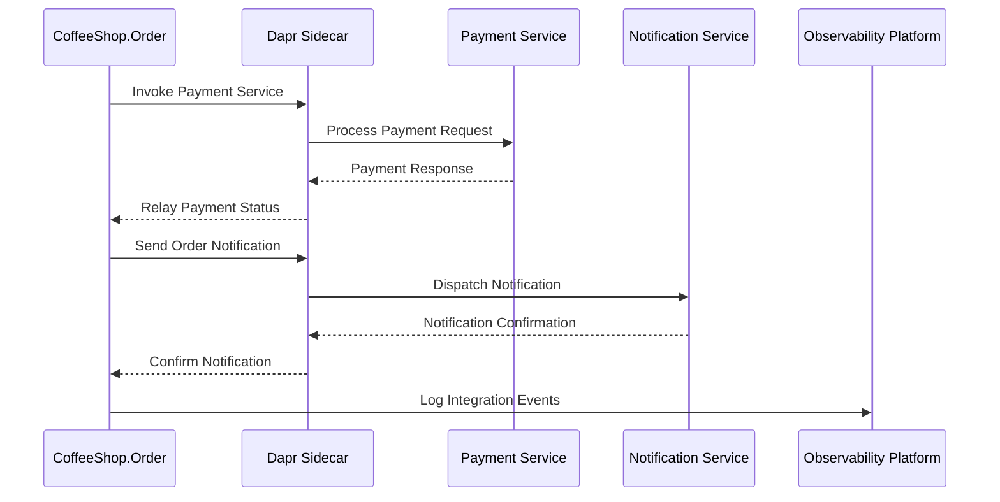

# External Service Integration Architecture

## Integration Flow Sequence Diagram



## Service Invocation Patterns

### Dapr Service Invocation
```csharp
public class PaymentIntegrationService
{
    private readonly DaprClient _daprClient;

    public async Task<PaymentResult> ProcessPayment(PaymentRequest request)
    {
        return await _daprClient.InvokeMethodAsync<PaymentRequest, PaymentResult>(
            "payment-service",    // Target service
            "process-payment",    // Method/endpoint
            request,              // Payload
            new InvocationOptions
            {
                HttpMethod = HttpMethod.Post,
                Timeout = TimeSpan.FromSeconds(10)
            }
        );
    }
}
```

## Resilience Policies

### Retry Configuration
```csharp
public class ResiliencePolicyBuilder
{
    public static IAsyncPolicy<PaymentResult> CreatePaymentPolicy()
    {
        return Policy
            .Handle<HttpRequestException>()
            .Or<TimeoutException>()
            .WaitAndRetryAsync(
                retryCount: 3,
                sleepDurationProvider: attempt =>
                    TimeSpan.FromSeconds(Math.Pow(2, attempt)),
                onRetry: (exception, timespan, attempt, context) =>
                {
                    // Log retry attempts
                }
            );
    }
}
```

### Circuit Breaker Pattern
```csharp
public class CircuitBreakerConfiguration
{
    public static IAsyncPolicy<PaymentResult> CreateCircuitBreakerPolicy()
    {
        return Policy
            .Handle<HttpRequestException>()
            .CircuitBreakerAsync(
                exceptionsAllowedBeforeBreaking: 3,
                durationOfBreak: TimeSpan.FromSeconds(30),
                onBreak: (exception, duration) => {
                    // Log circuit open
                },
                onReset: () => {
                    // Log circuit closed
                }
            );
    }
}
```

## External Service Configuration

### Payment Service Integration
- **Endpoint**: `https://challenge.trio.dev/api/v1/payment`
- **Method**: POST
- **Request Payload**:
```json
{
    "orderId": "uuid",
    "amount": 12.50,
    "currency": "USD",
    "paymentMethod": "credit_card"
}
```

### Notification Service Integration
- **Endpoint**: `https://challenge.trio.dev/api/v1/notification`
- **Method**: POST
- **Request Payload**:
```json
{
    "type": "order_status",
    "orderId": "uuid",
    "status": "prepared",
    "customerEmail": "user@example.com"
}
```

## Error Handling Strategies

### Problem Details Response
```csharp
public record IntegrationErrorResponse
{
    public string TraceId { get; init; }
    public int StatusCode { get; init; }
    public string ErrorType { get; init; }
    public string Detail { get; init; }
    public DateTime Timestamp { get; init; }
}
```

## Logging and Observability

### Integration Event Structure
```csharp
public record IntegrationEvent
{
    public Guid EventId { get; init; }
    public string ServiceName { get; init; }
    public string EventType { get; init; }
    public object Payload { get; init; }
    public DateTime Timestamp { get; init; }
    public Dictionary<string, string> Metadata { get; init; }
}
```

## Configuration Example
```csharp
services.AddHttpClient("PaymentService")
    .AddPolicyHandler(ResiliencePolicyBuilder.CreatePaymentPolicy())
    .AddPolicyHandler(ResiliencePolicyBuilder.CreateCircuitBreakerPolicy());
```

## Key Design Principles
- Decoupled service communication
- Comprehensive error handling
- Retry and circuit breaker mechanisms
- Distributed tracing support
- Observability through structured logging

## Performance Considerations
- Minimal serialization overhead
- Efficient timeout management
- Adaptive retry strategies
- Low-latency service communication