# Coffee Shop Order Management: Risk Analysis

## Risk Matrix Visualization

```mermaid
graph TD
    subgraph "Risk Severity"
    A[Critical 🔴] --> |High Impact| B[Blocking Implementation]
    C[High 🟠] --> |Significant Risk| D[Requires Immediate Mitigation]
    E[Medium 🟡] --> |Moderate Impact| F[Manage During Implementation]
    G[Low 🟢] --> |Minimal Impact| H[Monitor and Accept]
    end
```

## Critical Risks (🔴 Blocking Implementation)

| Risk ID | Category | Risk Description | Severity | Probability | Impact | Mitigation Strategy | Contingency Plan | Owner |
|---------|----------|-----------------|----------|-------------|--------|---------------------|-----------------|-------|
| R-001 | Security | Token Security Vulnerabilities | 🔴 Critical | High | Potential unauthorized access, data breaches | Implement robust token validation, use Azure AD B2C, enforce strict OIDC policies | Fallback to simplified authentication, manual user verification | Identity Service |
| R-002 | Data | PostgreSQL Migration Complexity | 🔴 Critical | High | Data loss, schema incompatibility | Comprehensive migration script, thorough data validation, staging migration | Maintain SQL Server as backup, incremental migration | Data Infrastructure |
| R-003 | Integration | Payment Service Dependency | 🔴 Critical | High | Order processing blockage, financial inconsistencies | Implement circuit breaker, robust error handling, async retry mechanism | Manual order processing, temporary offline mode | Order Service |

## High Risks (🟠 Significant Risk)

| Risk ID | Category | Risk Description | Severity | Probability | Impact | Mitigation Strategy | Contingency Plan | Owner |
|---------|----------|-----------------|----------|-------------|--------|---------------------|-----------------|-------|
| R-004 | Technical | Dapr Sidecar Reliability | 🟠 High | Medium | Service communication failures | Comprehensive health checks, observability, retry policies | Fallback to direct service communication | Infrastructure |
| R-005 | Development | CQRS/DDD Learning Curve | 🟠 High | Medium | Over-engineering, performance issues | Pair programming, architectural review, performance profiling | Simplify to traditional layered architecture | Development Team |
| R-006 | Security | Secret Management Complexity | 🟠 High | Medium | Potential secret exposure | Use Azure Key Vault, implement secret rotation, audit logs | Manual secret management, reduced automation | Security Team |

## Medium Risks (🟡 Moderate Impact)

| Risk ID | Category | Risk Description | Severity | Probability | Impact | Mitigation Strategy | Contingency Plan | Owner |
|---------|----------|-----------------|----------|-------------|--------|---------------------|-----------------|-------|
| R-007 | Integration | Notification Service Failures | 🟡 Medium | Low | Delayed order status updates | Implement async notification, queuing system | Manual status communication | Notification Service |
| R-008 | Data | Redis Cache Invalidation | 🟡 Medium | Low | Stale data, inconsistent product information | Implement cache versioning, time-based expiration | Fallback to direct database queries | Caching Service |

## Low Risks (🟢 Minimal Impact)

| Risk ID | Category | Risk Description | Severity | Probability | Impact | Mitigation Strategy | Contingency Plan | Owner |
|---------|----------|-----------------|----------|-------------|--------|---------------------|-----------------|-------|
| R-009 | Operational | Development Environment Setup | 🟢 Low | Low | Onboarding delays | Containerized dev environment, detailed setup docs | Manual local setup guide | DevOps |
| R-010 | Security | CORS Configuration | 🟢 Low | Low | Potential frontend access issues | Comprehensive CORS policy, staged rollout | Manual IP whitelisting | Frontend Service |

## Risk Monitoring Approach

1. **Weekly Risk Review Meetings**
   - Assess current risk status
   - Update mitigation strategies
   - Track risk progression

2. **Continuous Monitoring Tools**
   - Azure Application Insights
   - Dapr observability integrations
   - Custom monitoring dashboards

3. **Incident Response Plan**
   - Clear escalation matrix
   - Defined rollback procedures
   - Communication protocols

## Critical Actions Before Implementation

1. Complete PostgreSQL migration strategy validation
2. Implement comprehensive token security measures
3. Design robust payment service integration with circuit breaker
4. Create detailed architectural documentation
5. Establish team training on CQRS and DDD patterns

## Conclusion

This risk analysis highlights three critical risks that must be addressed before project implementation:
- Token security vulnerabilities
- PostgreSQL migration complexity
- Payment service dependency risks

Addressing these risks proactively will significantly improve project success probability and reduce potential implementation challenges.

**Last Updated:** 2025-09-29
**Risk Assessment Version:** 1.0